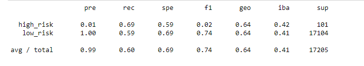
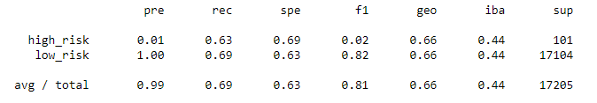
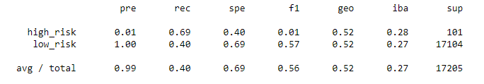
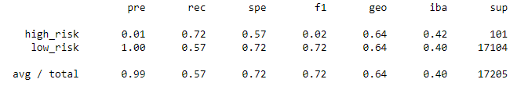
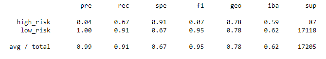
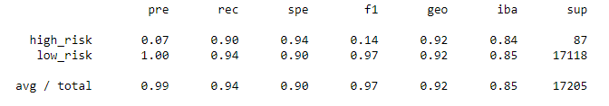

# Credit Risk Analysis

## Overview of the Credit Risk Analysis
The purpose of this project is to assist Fast Lending, a peer-to-peer lending services company, in using machine learning to predict credit risk. 

## Results 
#### Figure 1: *Naive Oversampling*
  
This model failed due to low scores in both precision and high risk.

#### Figure 2: *SMOTE*
  
The SMOTE model failed due to its precision score being very low.

#### Figure 3: *Undersampling*
  
The undersampling failed - also due to its precision score being too low.

#### Figure 4: *Combination*
  
The combination method is no good. Its precision score is too low.

#### Figure 5: *Balanced Random Forest Classifier*
 
This method is better than the previous methods due to its precision score being higher. 

#### Figure 6: *Easy Ensemble AdaBoost Classifier*
  
The AdaBoost method is superior as well due to its precision score being higher.

## Summary
All of the models have a low precision score. The balanced random forest and easy ensemble AdaBoost classifiers were higher than those of the four models but even then, they too also have low precision scores.  

Because all methods failed, one should use a more a advanced model, such as neural networks. Or perhaps more data is needed in order to successfully use one of the six current models accurately.